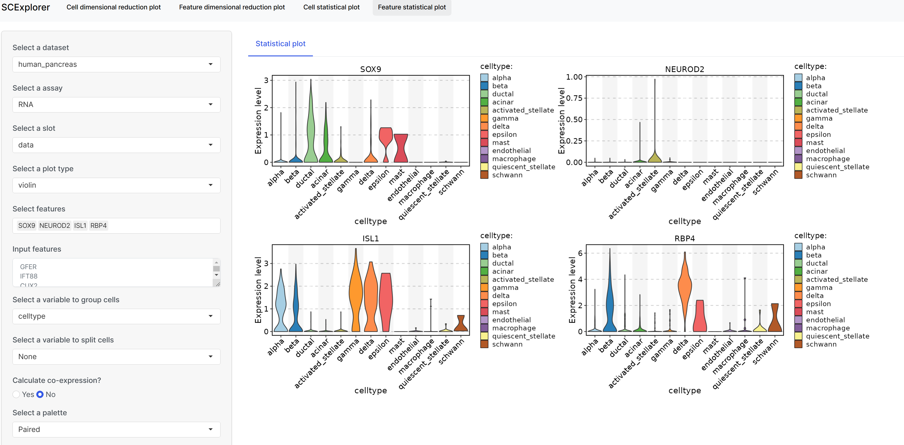
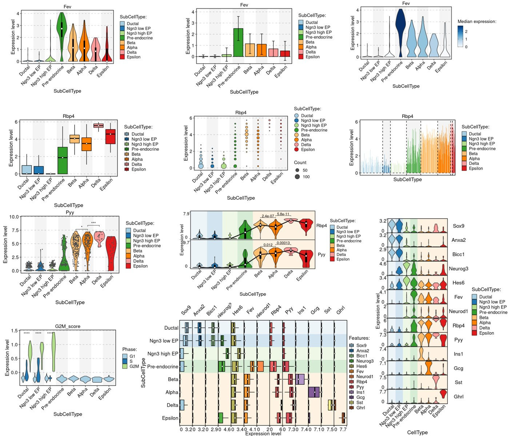
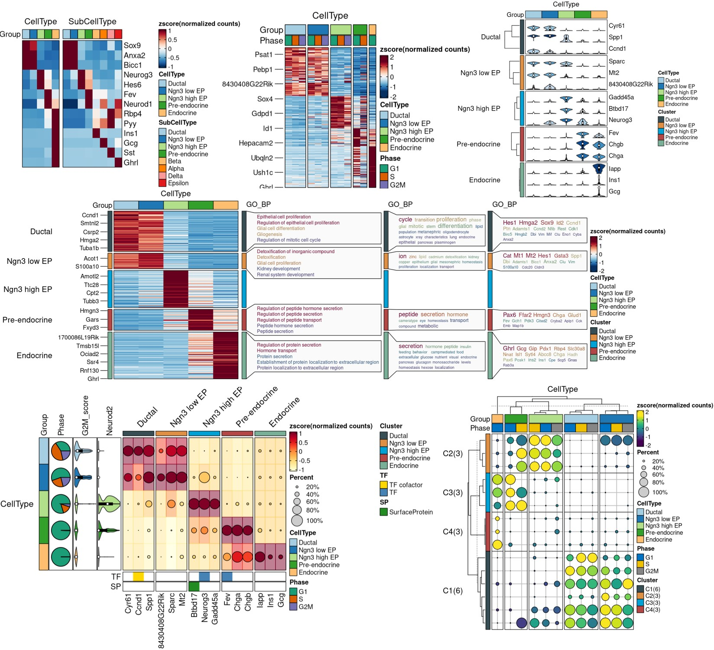

# scop: Single-Cell Omics analysis Pipeline

<!-- badges: start -->

[](https://github.com/mengxu98/scop/blob/main/DESCRIPTION) [](https://github.com/mengxu98/scop/actions/workflows/pkgdown.yaml) [](https://github.com/mengxu98/scop)

<!-- badges: end -->

## Overview
The [*`scop`*](https://github.com/mengxu98/scop) package provides a comprehensive set of tools for single-cell sequencing data processing and downstream analysis.

> [!IMPORTANT]
>
> [0.0.5] Update test data `pancreas_sub` and `panc8_sub` to Seurat v5.
>
> [0.0.6] Add `GetAssayData5()` function, which is a re-implementation of the GetAssayData function to compatible with Assay5 objects.
> 
> [0.0.6] Update `GetFeaturesData()` and `AddFeaturesData()` functions to obtain or add metadata of features.
>
> [0.0.9] Fixed the `PrepareEnv()` function, with the default Python version set to '3.10-1'. Now it can successfully run functions such as `RunPAGA()` and `RunSCVELO()` 'based on the Python environment.

## Introduction
The [*`scop`*](https://github.com/mengxu98/scop) package includes the following facilities:

-   Integrated single-cell quality control methods.
-   Pipelines embedded with multiple methods for normalization, feature reduction, and cell population identification (standard Seurat workflow).
-   Pipelines embedded with multiple integration methods for scRNA-seq or scATAC-seq data, including Uncorrected, [Seurat](https://github.com/satijalab/seurat), [scVI](https://github.com/scverse/scvi-tools), [MNN](http://www.bioconductor.org/packages/release/bioc/html/batchelor.html), [fastMNN](http://www.bioconductor.org/packages/release/bioc/html/batchelor.html), [Harmony](https://github.com/immunogenomics/harmony), [Scanorama](https://github.com/brianhie/scanorama), [BBKNN](https://github.com/Teichlab/bbknn), [CSS](https://github.com/quadbiolab/simspec), [LIGER](https://github.com/welch-lab/liger), [Conos](https://github.com/kharchenkolab/conos), [ComBat](https://bioconductor.org/packages/release/bioc/html/sva.html).
-   Multiple single-cell downstream analyses such as identification of differential features, enrichment analysis, GSEA analysis, identification of dynamic features, [PAGA](https://github.com/theislab/paga), [RNA velocity](https://github.com/theislab/scvelo), [Palantir](https://github.com/dpeerlab/Palantir), [Monocle2](http://cole-trapnell-lab.github.io/monocle-release), [Monocle3](https://cole-trapnell-lab.github.io/monocle3), etc.
-   Multiple methods for automatic annotation of single-cell data and methods for projection between single-cell datasets.
-   High-quality data visualization methods.
-   Fast deployment of single-cell data into SCExplorer, a [shiny app](https://shiny.rstudio.com/) that provides an interactive visualization interface.

The functions in the scop package are all developed around the [Seurat object](https://github.com/mojaveazure/seurat-object) and are compatible with other Seurat functions.

## Credits

The [*`scop`*](https://github.com/mengxu98/scop) package is developed based on the [*`SCP`*](https://github.com/zhanghao-njmu/SCP) package, making it compatible with Seurat V5 and adding support for multiple omics data.

## R version requirement

-   R \>= 4.1.0

## Installation in the global R environment

You can install the latest version of scop from [GitHub](https://github.com/mengxu98/scop) with:

``` r
if (!require("pak", quietly = TRUE)) {
  install.packages("pak")
}
pak::pak("mengxu98/scop")
```

#### Create a python environment for scop

To run functions such as `RunPAGA` or `RunSCVELO`, scop requires [conda](https://docs.conda.io/en/latest/miniconda.html) to create a separate python environment. The default environment name is `"scop_env"`. You can specify the environment name for scop by setting `options(scop_env_name="new_name")`

Now, you can run `PrepareEnv()` to create the python environment for scop. If the conda binary is not found, it will automatically download and install miniconda.

``` r
scop::PrepareEnv()
```

To force scop to use a specific conda binary, it is recommended to set `reticulate.conda_binary` R option:

``` r
options(reticulate.conda_binary = "/path/to/conda")
scop::PrepareEnv()
```

If the download of miniconda or pip packages is slow, you can specify the miniconda repo and PyPI mirror according to your network region.

``` r
scop::PrepareEnv(
  miniconda_repo = "https://mirrors.bfsu.edu.cn/anaconda/miniconda",
  pip_options = "-i https://pypi.tuna.tsinghua.edu.cn/simple"
)
```

Available miniconda repositories:

-   <https://repo.anaconda.com/miniconda> (default)

-   <http://mirrors.aliyun.com/anaconda/miniconda>

-   <https://mirrors.bfsu.edu.cn/anaconda/miniconda>

-   <https://mirrors.pku.edu.cn/anaconda/miniconda>

-   <https://mirror.nju.edu.cn/anaconda/miniconda>

-   <https://mirrors.sustech.edu.cn/anaconda/miniconda>

-   <https://mirrors.xjtu.edu.cn/anaconda/miniconda>

-   <https://mirrors.hit.edu.cn/anaconda/miniconda>

Available PyPI mirrors:

-   <https://pypi.python.org/simple> (default)

-   <https://mirrors.aliyun.com/pypi/simple>

-   <https://pypi.tuna.tsinghua.edu.cn/simple>

-   <https://mirrors.pku.edu.cn/pypi/simple>

-   <https://mirror.nju.edu.cn/pypi/web/simple>

-   <https://mirrors.sustech.edu.cn/pypi/simple>

-   <https://mirrors.xjtu.edu.cn/pypi/simple>

-   <https://mirrors.hit.edu.cn/pypi/web/simple>

## Installation in an isolated R environment using renv

If you do not want to change your current R environment or require reproducibility, you can use the [renv](https://rstudio.github.io/renv/) package to install scop into an isolated R environment.

#### Create an isolated R environment

``` r
if (!require("renv", quietly = TRUE)) {
  install.packages("renv")
}
dir.create("~/scop_env", recursive = TRUE) # It cannot be the home directory "~" !
renv::init(project = "~/scop_env", bare = TRUE, restart = TRUE)
```

Option 1: Install scop from GitHub and create scop python environment

``` r
renv::activate(project = "~/scop_env")
renv::install("BiocManager")
renv::install("mengxu98/scop", repos = BiocManager::repositories())
scop::PrepareEnv()
```

Option 2: If scop is already installed in the global environment, copy scop from the local library

``` r
renv::activate(project = "~/scop_env")
renv::hydrate("scop")
scop::PrepareEnv()
```

#### Activate scop environment first before use

``` r
renv::activate(project = "~/scop_env")

library(scop)
data("pancreas_sub")
pancreas_sub <- RunPAGA(
  srt = pancreas_sub,
  group_by = "SubCellType",
  linear_reduction = "PCA",
  nonlinear_reduction = "UMAP"
)
CellDimPlot(
  pancreas_sub,
  group.by = "SubCellType",
  reduction = "draw_graph_fr"
)
```

#### Save and restore the state of scop environment

``` r
renv::snapshot(project = "~/scop_env")
renv::restore(project = "~/scop_env")
```

## Quick Start

- [scop: Single-Cell Omics analysis Pipeline](#scop-single-cell-omics-analysis-pipeline)
  - [Overview](#overview)
  - [Introduction](#introduction)
  - [Credits](#credits)
  - [R version requirement](#r-version-requirement)
  - [Installation in the global R environment](#installation-in-the-global-r-environment)
      - [Create a python environment for scop](#create-a-python-environment-for-scop)
  - [Installation in an isolated R environment using renv](#installation-in-an-isolated-r-environment-using-renv)
      - [Create an isolated R environment](#create-an-isolated-r-environment)
      - [Activate scop environment first before use](#activate-scop-environment-first-before-use)
      - [Save and restore the state of scop environment](#save-and-restore-the-state-of-scop-environment)
  - [Quick Start](#quick-start)
    - [Data exploration](#data-exploration)
    - [CellQC](#cellqc)
    - [Standard pipeline](#standard-pipeline)
    - [Integration pipeline](#integration-pipeline)
    - [Cell projection between single-cell datasets](#cell-projection-between-single-cell-datasets)
    - [Cell annotation using bulk RNA-seq datasets](#cell-annotation-using-bulk-rna-seq-datasets)
    - [Cell annotation using single-cell datasets](#cell-annotation-using-single-cell-datasets)
    - [PAGA analysis](#paga-analysis)
    - [Velocity analysis](#velocity-analysis)
    - [Differential expression analysis](#differential-expression-analysis)
    - [Enrichment analysis(over-representation)](#enrichment-analysisover-representation)
    - [Enrichment analysis(GSEA)](#enrichment-analysisgsea)
    - [Trajectory inference](#trajectory-inference)
    - [Dynamic features](#dynamic-features)
    - [Interactive data visualization with SCExplorer](#interactive-data-visualization-with-scexplorer)
    - [Other visualization examples](#other-visualization-examples)

### Data exploration

The analysis is based on a subsetted version of [mouse pancreas data](https://doi.org/10.1242/dev.173849).

``` r
library(scop)
library(BiocParallel)
register(MulticoreParam(workers = 8, progressbar = TRUE))

data("pancreas_sub")
print(pancreas_sub)
#> An object of class Seurat
#> 15000 features across 1000 samples within 3 assays
#> Active assay: RNA (5000 features, 623 variable features)
#> 3 layers present: counts, data, scale.data
#> 2 other assays present: spliced, unspliced
#> 3 dimensional reductions calculated: pca, umap, tsne
```

``` r
CellDimPlot(
  srt = pancreas_sub,
  group.by = c("CellType", "SubCellType"),
  reduction = "UMAP",
  theme_use = "theme_blank"
)
```


``` r
CellDimPlot(
  srt = pancreas_sub, group.by = "SubCellType", stat.by = "Phase",
  reduction = "UMAP", theme_use = "theme_blank"
)
```


``` r
FeatureDimPlot(
  srt = pancreas_sub,
  features = c("Sox9", "Neurog3", "Fev", "Rbp4"),
  reduction = "UMAP",
  theme_use = "theme_blank"
)
```


``` r
FeatureDimPlot(
  srt = pancreas_sub,
  features = c("Ins1", "Gcg", "Sst", "Ghrl"),
  compare_features = TRUE,
  label = TRUE,
  label_insitu = TRUE,
  reduction = "UMAP",
  theme_use = "theme_blank"
)
```


``` r
ht <- GroupHeatmap(
  srt = pancreas_sub,
  features = c(
    "Sox9", "Anxa2", # Ductal
    "Neurog3", "Hes6", # EPs
    "Fev", "Neurod1", # Pre-endocrine
    "Rbp4", "Pyy", # Endocrine
    "Ins1", "Gcg", "Sst", "Ghrl" # Beta, Alpha, Delta, Epsilon
  ),
  group.by = c("CellType", "SubCellType"),
  heatmap_palette = "YlOrRd",
  cell_annotation = c("Phase", "G2M_score", "Cdh2"),
  cell_annotation_palette = c("Dark2", "Paired", "Paired"),
  show_row_names = TRUE, row_names_side = "left",
  add_dot = TRUE, add_reticle = TRUE
)
print(ht$plot)
```


### CellQC

``` r
pancreas_sub <- RunCellQC(srt = pancreas_sub)
CellDimPlot(srt = pancreas_sub, group.by = "CellQC", reduction = "UMAP")
```


``` r
CellStatPlot(srt = pancreas_sub, stat.by = "CellQC", group.by = "CellType", label = TRUE)
```


``` r
CellStatPlot(
  srt = pancreas_sub,
  stat.by = c(
    "db_qc", "outlier_qc",
    "umi_qc", "gene_qc",
    "mito_qc", "ribo_qc",
    "ribo_mito_ratio_qc", "species_qc"
  ),
  plot_type = "upset",
  stat_level = "Fail"
)
```


### Standard pipeline

``` r
pancreas_sub <- standard_scop(srt = pancreas_sub)
CellDimPlot(
  srt = pancreas_sub,
  group.by = c("CellType", "SubCellType"),
  reduction = "StandardUMAP2D",
  theme_use = "theme_blank"
)
```


``` r
CellDimPlot3D(
  srt = pancreas_sub,
  group.by = "SubCellType"
)
```


``` r
FeatureDimPlot3D(
  srt = pancreas_sub,
  features = c("Sox9", "Neurog3", "Fev", "Rbp4")
)
```


### Integration pipeline

Example data for integration is a subsetted version of [panc8(eight human pancreas datasets)](https://github.com/satijalab/seurat-data)

``` r
data("panc8_sub")
panc8_sub <- integration_scop(
  srt_merge = panc8_sub,
  batch = "tech",
  integration_method = "Seurat"
)
CellDimPlot(
  srt = panc8_sub,
  group.by = c("celltype", "tech"),
  reduction = "SeuratUMAP2D",
  title = "Seurat",
  theme_use = "theme_blank"
)
```


UMAP embeddings based on different integration methods in scop:


### Cell projection between single-cell datasets

``` r
panc8_rename <- RenameFeatures(
  srt = panc8_sub,
  newnames = make.unique(
    capitalize(rownames(panc8_sub[["RNA"]]),
    force_tolower = TRUE)
  ),
  assays = "RNA"
)
srt_query <- RunKNNMap(
  srt_query = pancreas_sub,
  srt_ref = panc8_rename,
  ref_umap = "SeuratUMAP2D")
ProjectionPlot(
  srt_query = srt_query,
  srt_ref = panc8_rename,
  query_group = "SubCellType",
  ref_group = "celltype"
)
```


### Cell annotation using bulk RNA-seq datasets

``` r
data("ref_scMCA")
pancreas_sub <- RunKNNPredict(
  srt_query = pancreas_sub,
  bulk_ref = ref_scMCA,
  filter_lowfreq = 20
)
CellDimPlot(
  srt = pancreas_sub,
  group.by = "KNNPredict_classification",
  reduction = "UMAP",
  label = TRUE
)
```


### Cell annotation using single-cell datasets

``` r
pancreas_sub <- RunKNNPredict(
  srt_query = pancreas_sub,
  srt_ref = panc8_rename,
  ref_group = "celltype",
  filter_lowfreq = 20
)
CellDimPlot(
  srt = pancreas_sub,
  group.by = "KNNPredict_classification",
  reduction = "UMAP",
  label = TRUE
)
```


``` r

pancreas_sub <- RunKNNPredict(
  srt_query = pancreas_sub,
  srt_ref = panc8_rename,
  query_group = "SubCellType",
  ref_group = "celltype",
  return_full_distance_matrix = TRUE
)
CellDimPlot(
  srt = pancreas_sub,
  group.by = "KNNPredict_classification",
  reduction = "UMAP",
  label = TRUE
)
```


``` r

ht <- CellCorHeatmap(
  srt_query = pancreas_sub,
  srt_ref = panc8_rename,
  query_group = "SubCellType",
  ref_group = "celltype",
  nlabel = 3,
  label_by = "row",
  show_row_names = TRUE,
  show_column_names = TRUE
)
print(ht$plot)
```


### PAGA analysis

``` r
pancreas_sub <- RunPAGA(
  srt = pancreas_sub,
  group_by = "SubCellType",
  linear_reduction = "PCA",
  nonlinear_reduction = "UMAP"
)
PAGAPlot(
  srt = pancreas_sub,
  reduction = "UMAP",
  label = TRUE,
  label_insitu = TRUE,
  label_repel = TRUE
)
```


### Velocity analysis

> To estimate RNA velocity, you need to have both “spliced” and “unspliced” assays in your Seurat object. You can generate these matrices using [velocyto](http://velocyto.org/velocyto.py/index.html), [bustools](https://bustools.github.io/BUS_notebooks_R/velocity.html), or [alevin](https://combine-lab.github.io/alevin-fry-tutorials/2021/alevin-fry-velocity/).

``` r
pancreas_sub <- RunSCVELO(
  srt = pancreas_sub,
  group_by = "SubCellType",
  linear_reduction = "PCA",
  nonlinear_reduction = "UMAP"
)
VelocityPlot(
  srt = pancreas_sub,
  reduction = "UMAP",
  group_by = "SubCellType"
)
```


``` r
VelocityPlot(
  srt = pancreas_sub,
  reduction = "UMAP",
  plot_type = "stream"
)
```


### Differential expression analysis

``` r
pancreas_sub <- RunDEtest(
  srt = pancreas_sub,
  group_by = "CellType",
  fc.threshold = 1,
  only.pos = FALSE
)
VolcanoPlot(
  srt = pancreas_sub,
  group_by = "CellType"
)
```


``` r
DEGs <- pancreas_sub@tools$DEtest_CellType$AllMarkers_wilcox
DEGs <- DEGs[with(DEGs, avg_log2FC > 1 & p_val_adj < 0.05), ]
# Annotate features with transcription factors and surface proteins
pancreas_sub <- AnnotateFeatures(
  pancreas_sub,
  species = "Mus_musculus",
  db = c("TF", "CSPA")
)
ht <- FeatureHeatmap(
  srt = pancreas_sub,
  group.by = "CellType",
  features = DEGs$gene,
  feature_split = DEGs$group1,
  species = "Mus_musculus",
  db = c("GO_BP", "KEGG", "WikiPathway"),
  anno_terms = TRUE,
  feature_annotation = c("TF", "CSPA"),
  feature_annotation_palcolor = list(
    c("gold", "steelblue"), c("forestgreen")
  ),
  height = 5, width = 4
)
print(ht$plot)
```


### Enrichment analysis(over-representation)

``` r
pancreas_sub <- RunEnrichment(
  srt = pancreas_sub,
  group_by = "CellType",
  db = "GO_BP",
  species = "Mus_musculus",
  DE_threshold = "avg_log2FC > log2(1.5) & p_val_adj < 0.05"
)
EnrichmentPlot(
  srt = pancreas_sub,
  group_by = "CellType",
  group_use = c("Ductal", "Endocrine"),
  plot_type = "bar"
)
```


``` r
EnrichmentPlot(
  srt = pancreas_sub,
  group_by = "CellType",
  group_use = c("Ductal", "Endocrine"),
  plot_type = "wordcloud"
)
```


``` r
EnrichmentPlot(
  srt = pancreas_sub,
  group_by = "CellType",
  group_use = c("Ductal", "Endocrine"),
  plot_type = "wordcloud",
  word_type = "feature"
)
```


``` r
EnrichmentPlot(
  srt = pancreas_sub,
  group_by = "CellType",
  group_use = "Ductal",
  plot_type = "network"
)
```


> To ensure that labels are visible, you can adjust the size of the viewer panel on Rstudio IDE.

``` r
EnrichmentPlot(
  srt = pancreas_sub,
  group_by = "CellType",
  group_use = "Ductal",
  plot_type = "enrichmap"
)
```


``` r
EnrichmentPlot(
  srt = pancreas_sub,
  group_by = "CellType",
  plot_type = "comparison"
)
```


### Enrichment analysis(GSEA)

``` r
pancreas_sub <- RunGSEA(
  srt = pancreas_sub,
  group_by = "CellType",
  db = "GO_BP",
  species = "Mus_musculus",
  DE_threshold = "p_val_adj < 0.05"
)
GSEAPlot(
  srt = pancreas_sub,
  group_by = "CellType",
  group_use = "Endocrine",
  id_use = "GO:0007186"
)
```


``` r
GSEAPlot(
  srt = pancreas_sub,
  group_by = "CellType",
  group_use = "Endocrine",
  plot_type = "bar",
  direction = "both",
  topTerm = 20
)
```


``` r
GSEAPlot(
  srt = pancreas_sub,
  group_by = "CellType",
  plot_type = "comparison"
)
```


### Trajectory inference

``` r
pancreas_sub <- RunSlingshot(
  srt = pancreas_sub,
  group.by = "SubCellType",
  reduction = "UMAP"
)
```


``` r
FeatureDimPlot(
  pancreas_sub,
  features = paste0("Lineage", 1:3),
  reduction = "UMAP",
  theme_use = "theme_blank"
)
```


``` r
CellDimPlot(
  pancreas_sub,
  group.by = "SubCellType",
  reduction = "UMAP",
  lineages = paste0("Lineage", 1:3),
  lineages_span = 0.1
)
```


### Dynamic features

``` r
pancreas_sub <- RunDynamicFeatures(
  srt = pancreas_sub,
  lineages = c("Lineage1", "Lineage2"),
  n_candidates = 200
)
ht <- DynamicHeatmap(
  srt = pancreas_sub,
  lineages = c("Lineage1", "Lineage2"),
  use_fitted = TRUE,
  n_split = 6,
  reverse_ht = "Lineage1",
  species = "Mus_musculus",
  db = "GO_BP",
  anno_terms = TRUE,
  anno_keys = TRUE,
  anno_features = TRUE,
  heatmap_palette = "viridis",
  cell_annotation = "SubCellType",
  separate_annotation = list(
    "SubCellType", c("Nnat", "Irx1")
  ),
  separate_annotation_palette = c("Paired", "Set1"),
  feature_annotation = c("TF", "CSPA"),
  feature_annotation_palcolor = list(
    c("gold", "steelblue"), c("forestgreen")
  ),
  pseudotime_label = 25,
  seudotime_label_color = "red",
  height = 5,
  width = 2
)
print(ht$plot)
```


``` r
DynamicPlot(
  srt = pancreas_sub,
  lineages = c("Lineage1", "Lineage2"),
  group.by = "SubCellType",
  features = c(
    "Plk1", "Hes1", "Neurod2", "Ghrl", "Gcg", "Ins2"
  ),
  compare_lineages = TRUE,
  compare_features = FALSE
)
```


``` r
FeatureStatPlot(
  srt = pancreas_sub,
  group.by = "SubCellType",
  bg.by = "CellType",
  stat.by = c("Sox9", "Neurod2", "Isl1", "Rbp4"),
  add_box = TRUE,
  comparisons = list(
    c("Ductal", "Ngn3 low EP"),
    c("Ngn3 high EP", "Pre-endocrine"),
    c("Alpha", "Beta")
  )
)
```


### Interactive data visualization with SCExplorer

``` r
PrepareSCExplorer(
  list(
    mouse_pancreas = pancreas_sub,
    human_pancreas = panc8_sub
  ),
  base_dir = "./SCExplorer"
)
app <- RunSCExplorer(base_dir = "./SCExplorer")
list.files("./SCExplorer") # This directory can be used as site directory for Shiny Server.

if (interactive()) {
  shiny::runApp(app)
}
```

 

### Other visualization examples

[**CellDimPlot**](https://mengxu98.github.io/scop/reference/CellDimPlot.html) [**CellStatPlot**](https://mengxu98.github.io/scop/reference/CellStatPlot.html) [**FeatureStatPlot**](https://mengxu98.github.io/scop/reference/FeatureStatPlot.html) [**GroupHeatmap**](https://mengxu98.github.io/scop/reference/GroupHeatmap.html)

You can also find more examples in the documentation of the function: [integration_scop](https://mengxu98.github.io/scop/reference/integration_scop.html), [RunKNNMap](https://mengxu98.github.io/scop/reference/RunKNNMap.html), [RunMonocle3](https://mengxu98.github.io/scop/reference/RunMonocle3.html), [RunPalantir](https://mengxu98.github.io/scop/reference/RunPalantir.html), etc.
